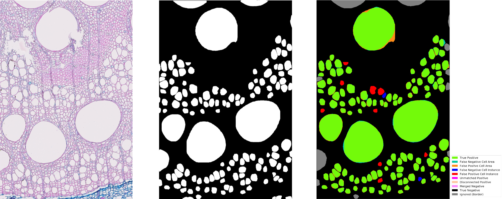
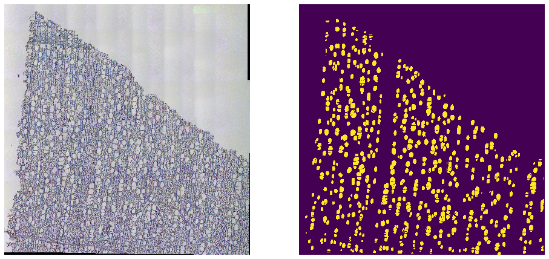

## Cell detection for wood thin section microscope images
***
Source code for publication (in review):

```Resente, G. et al. "Mask, Train, Repeat! Artificial Intelligence for Quantitative Wood Anatomy" (2021)```

***
Example result (oak) and error map:




Example on a full sized image (alnus):


